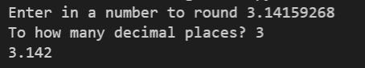

# 1-6 Exercise 3

### The assignment
Edit the file named "student.py".  
Take in two inputs, one as a decimal and the other as how many decimal places to round to:  
  
  
#### HINT  
It may be easier to round it mathematically BEFORE placing it in the f string.

## Check your work
Select the "Actions" tab on GitHub and select your latest commit. This will show you if your exercise passes all test cases.
