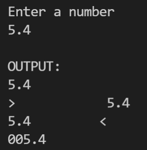

# 1-6 Exercise 2

### The assignment
Edit the file named "student.py".  
Using f strings make a program that takes in one number (with decimals) and outputs it in the following formats (use one line for each):  
•	2 decimal places  
•	Aligned right (give it 15 character spaces)  
•	Aligned leftt (give it 12 character spaces)  
•	Pad the number with zeros up to 5 digits.  
  
#### Example  
  
  
#### Note  
The number of spaces change depending on the length of the number you enter. The order does not matter which line goes first as long as all are output.

## Check your work
Select the "Actions" tab on GitHub and select your latest commit. This will show you if your exercise passes all test cases.
